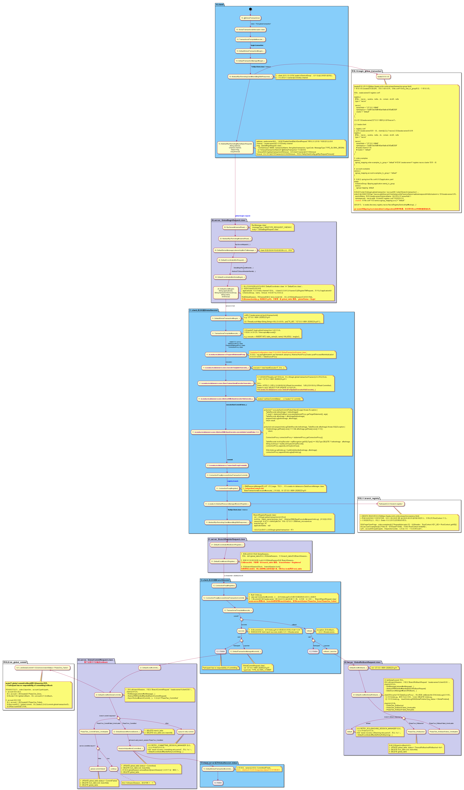

# seata

## 0. 源码调用链


2020-02-28 >>>>
完整的，大概了解整个seata是怎么样的...虽然不知道看了了解了有什么鸟用...
依然不知道接下来去哪，接下来想做什么，迷茫的five~~

## 1. seata的client-batch-request
源码：
- `AbstractRpcRemoting#sendAsyncRequest(...)`
- `MergedSendRunnable.class`

逻辑大概是，seata-client启动时，创建1个线程在后台一直运行（获取mergeLock再等待1ms）
然后取出 basketMap 中所有的请求，相同address组装后发送。

不知道怎么说，感觉存在一些性能问题。比如可能某次消息量很大，这个间隔时间不支持配置等问题...

## 2. seata逻辑并不是完全的严谨！
例如commit-global-transaction：  
`TransactionalTemplate#execute()` -> `DefaultGlobalTransaction#commit()` -> `DefaultCore#commit(...)`

seata-server返回的不一定是`Committed/Finish`，还可能因为无法获取lock，所以`!shouldCommit = true`。
此时其实可以说是提交失败，但是seata-client认为是提交成功。
（即，client其实并未使用这次请求的response，除非请求异常）

**seata 的一个重要原则（个人觉得）：**
结合以上的问题，假设现在tx1是Launcher，tx2是Participant。  
如果tx2提交异常，但接口返回正常（只是code是异常码），此时，tx1中需要执行手动判断并throw-exception。
否则，如果tx1执行global-commit，那么其实是忽略了tx2的异常。此时会正常提交并完成全局事务。


## 3.GlobalSession 与 BranchSession

> [SEATA 微服务框架支持](https://seata.io/zh-cn/docs/user/microservice.html)
> 跨服务调用的事务传播
> 跨服务调用场景下的事务传播，本质上就是要把 XID 通过服务调用传递到服务提供方，并绑定到 RootContext 中去。

即order在调用`AccountFeignClient`将xid传递过多，Account获取xid后`RooContext.bind(xid)`。

## **4.SEATA 与 FEIGN的结合**
+ seata-samples/springboot-mybatis/sbm-common-service
- [SeataFeignRequestInterceptor.java](/vergilyn-seata-examples/vergilyn-common-dependencies/src/main/java/com/vergilyn/examples/seata/SeataFeignRequestInterceptor.java)
- [SeataAutoConfiguration.java](/vergilyn-seata-examples/vergilyn-common-dependencies/src/main/java/com/vergilyn/examples/seata/SeataAutoConfiguration.java)

1. **ThreadLocal 与 负载均衡 结合的问题**
SEATA中的RootContext本质是用ThreadLocal实现的，所以在多线程下会出现null值。

+ [#2088 feign在做降级处理的时候无法触发seata的事务的回滚](https://github.com/seata/seata/issues/2088)
- [实用技巧：Hystrix传播ThreadLocal对象（两种方案](http://www.itmuch.com/spring-cloud-sum/hystrix-threadlocal/)

> [spring-cloud-feign-overriding-defaults](https://cloud.spring.io/spring-cloud-static/spring-cloud-openfeign/2.2.1.RELEASE/reference/html/#spring-cloud-feign-overriding-defaults)
> If you need to use ThreadLocal bound variables in your RequestInterceptor`s you will need to either
> set the thread isolation strategy for Hystrix to `SEMAPHORE or disable Hystrix in Feign.

```YAML
# application.yml

# To disable Hystrix in Feign
feign:
  hystrix:
    enabled: false

# To set thread isolation to SEMAPHORE
hystrix:
  command:
    default:
      execution:
        isolation:
          strategy: SEMAPHORE
```

## 5. 分支事务一定返回`PhaseTwo_Committed`
doGlobalCommit 时会去请求 doBranchCommit，client一定且只会返回`PhaseTwo_Committed`。  
这其实并不太影响什么，因为branch-transaction已经提交成功，现在也不需要rollback。
只是可能产生未删除UndoLog！！！！ 这个后续是如何处理的？

如果`ASYNC_COMMIT_BUFFER.offer(...)`成功，由代码可知async 1s后会删除UndoLog...那么如果要rollback怎么办？

- `io.seata.rm.datasource.AsyncWorker#branchCommit()`

## 6. seata中 global commit/rollback都只由launcher负责。
例如测试代码中，order是launcher，account是participant。
1. account 提交成功
  那么 account 上报给seata的 PhaseOne_Done。
  如果order不执行global-rollback，那么 account是不会rollback。

2. account 提交失败
  那么 account 上报给seata的 PhaseOne_Failed。
  如果account执行了global-commit，那么seata是会成功commit-global-transaction的。
  而忽略account的提交失败。

这也解释了`doGlobalCommit`中，为什么会直接 remove `BranchSession.status == BranchStatus.PhaseOne_Failed`


## 7. Data truncation: Data too long for column 'transaction_service_group' at row 1
表`global_table`中，默认"`transaction_service_group` VARCHAR(32)"。  
而txServiceGroup如果采用 {spring.application.name}_{custom} 的形式，那么很容易超过设置。